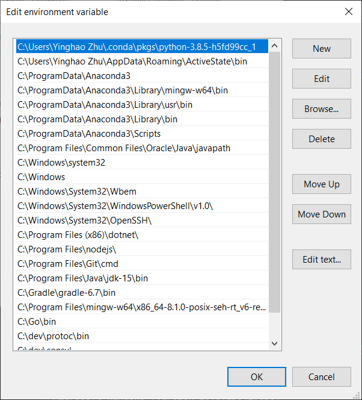
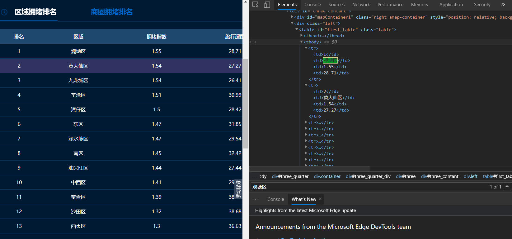
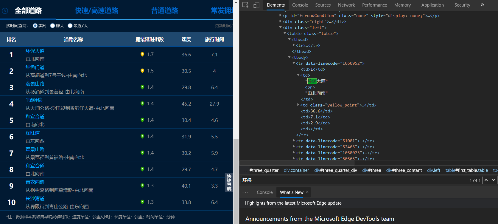
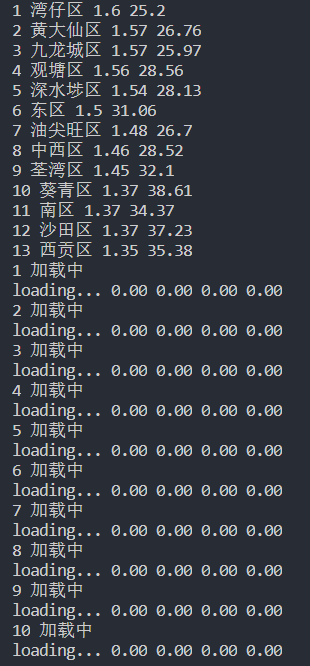
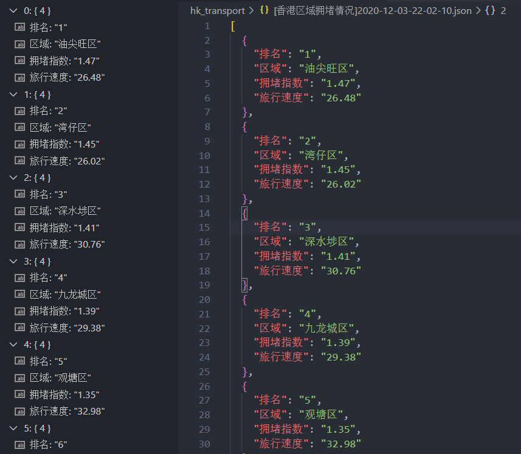
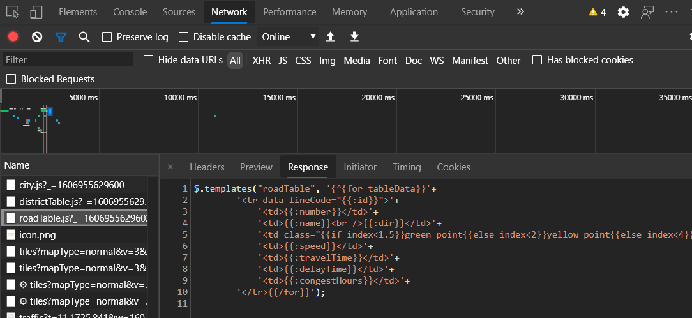
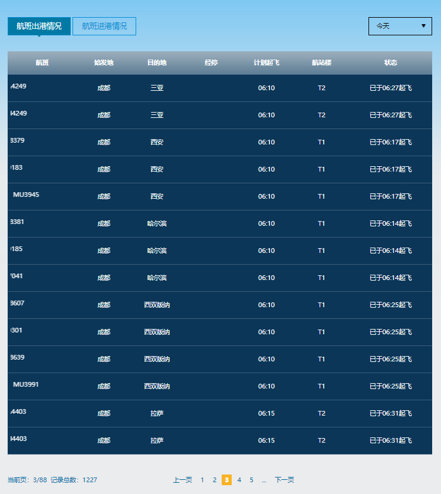
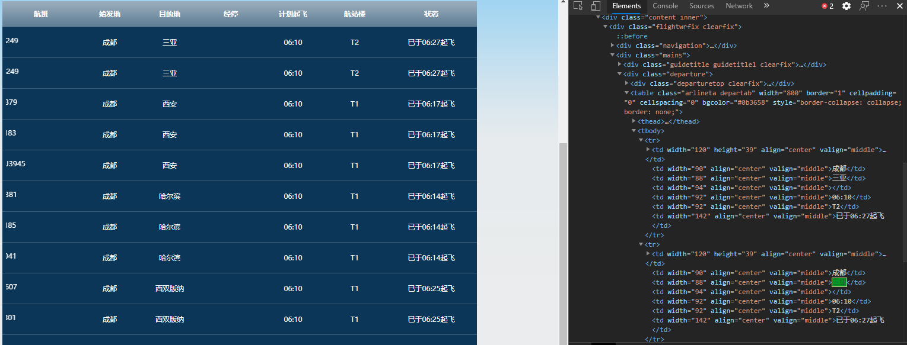
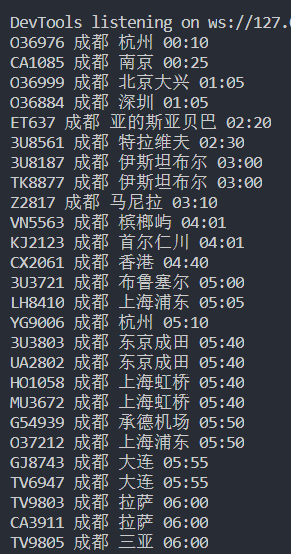
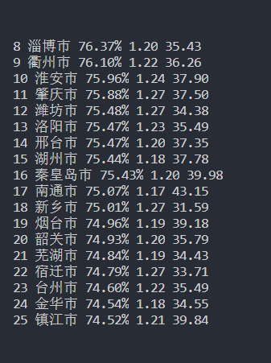

# traffic-crawler

> Computer Networks Course Assignment

[TOC]

## 环境配置

### 静态网页

- 安装Scrapy

```bash
pip install Scrapy
```

### 动态网页

- 安装selenium

> Selenium是一个用于Web应用程序测试的工具。直接运行在浏览器中，就像真正的用户在操作一样。支持的浏览器包括IE（7, 8, 9, 10, 11），Firefox，Safari，Chrome，Opera等，在爬虫上则是模拟正常用户访问网页并获取数据。

```bash
pip install selenium
```

- 安装驱动
  - [chromedriver](http://npm.taobao.org/mirrors/chromedriver/87.0.4280.88/)
  - 对应版本的Chrome(87.0.4280.88版)

- 注册环境变量

将chromedriver.exe放置于Python环境的根目录下：


将该目录注册至系统环境变量：



### 定时爬取的方法

见以下代码示例：

```python
import time
import os

while True:
    os.system("scrapy crawl pkx") # 执行爬虫脚本命令
    time.sleep(3600*24) # 定时运行，单位为秒
```

## Project 1: 北京大兴机场（静态）

> [北京大兴机场数据地址](http://data.carnoc.com/corp/airport/pkx__airportflight.html)

### 初始化项目

```bash
scrapy startproject flight
cd flight # into project directory: flight
scrapy genspider pkx "http://data.carnoc.com/corp/airport/pkx__airportflight.html"
```

我在此最终将最外层的flight文件夹，重命名为了：pkx_flight

目录结构：

```
pkx_flight/
    scrapy.cfg            # deploy configuration file
    main.py               # 执行定时爬取脚本
    flight/               # project's Python module, you'll import your code from here
        __init__.py
        items.py          # project items definition file
        middlewares.py    # project middlewares file (定义中间件，未用到)
        pipelines.py      # project pipelines file (含写入至文件的操作)
        settings.py       # project settings file
        spiders/          # a directory where you'll later put your spiders
            __init__.py
            pkx.py        # 选取html页面中元素的定义
            test.py       # 测试Python中对json操作的一些用法
```

**Note:**

- 在最外层的pkx_flight目录下开发（如VS Code中，打开该目录），防止import module error

### 如何运行

在外层pkx_flight目录下，`main.py`为定时（每2小时）爬取的脚本，亦可单次运行

```bash
scrapy crawl pkx # 单次爬取，pkx为在PkxSpider Class中定义的name
python main.py # 开始定时爬取
```

### 数据介绍

#### 数据来源

数据来自于[民航资源网](http://www.carnoc.com/)，从中选取北京大兴机场作为分析目标

- [北京大兴机场](http://data.carnoc.com/corp/airport/pkx__airportflight.html)网站内容


该网站对进港/出港情况、分时统计等数据动态滚动更新，具有一定的爬取难度。

我从中选择爬取北京大兴机场航班进港与出港情况的数据

#### 数据字段说明

| 字段名            | 说明                |
| ----------------- | ------------------- |
| flight_info       | 总进出港数据        |
| arrival           | 其下的均为进港数据  |
| depart            | 其下的出港数据      |
| type              | 表明类型：进港/出港 |
| flight_number     | 航班号              |
| from_city         | 始发地              |
| to_city           | 目的地              |
| pick_up_building  | 接机楼              |
| check_in_building | 乘机楼              |
| expect_time       | 预计到达时间        |
| actual_time       | 实际到达时间        |
| state             | 状态                |

### 爬取结果

- 所爬原始结果


- 格式化JSON

在VS Code中Format Document


- 数据的层次结构

在VS Code中安装json插件


打开json文件，如本次的北京大兴机场进出港情况xxx.json，点击左侧工具栏的Json图标


可展开查看详细信息(所含数量，具体字段内容)


## Project 2: 香港交通情况（动态，含反爬）

> [香港交通情况数据地址](https://report.amap.com/detail.do?city=810000)

### 爬取对象

检查页面元素查看数据所在位置：

- 区域拥堵排名



- 全部道路



可见以上两张表的xpath均可定义为"//table/tbody/tr"

以上数据是由js渲染所得，在此选择使用selenium来爬。

### 爬取过程

#### 通过selenium

编写如下代码`main.py`，试图来爬这两张表：

```python
from selenium import webdriver
from selenium.webdriver.chrome.options import Options
import time

chrome_options = Options()
chrome_options.add_argument("--headless")
driver = webdriver.Chrome(
    executable_path='chromedriver',
    options=chrome_options)
url='https://report.amap.com/detail.do?city=810000'
driver.get(url)
time.sleep(3) # 等待页面加载一段时间
node_list = driver.find_elements_by_xpath("//table/tbody/tr")
for node in node_list:
    print(node.text)
driver.close()
```

结果：



可见第一张表已成功爬得，而第二张表未爬取成功（高德地图有很强的反爬措施）

以下进行数据处理，只获取第一张表（修改xpath，添加筛选），并将其输出至json文件。代码如下：

```python
from selenium import webdriver
from selenium.webdriver.chrome.options import Options
import time
from datetime import datetime
import json

chrome_options = Options()
chrome_options.add_argument("--headless")
driver = webdriver.Chrome(
    executable_path='chromedriver',
    options=chrome_options)
url='https://report.amap.com/detail.do?city=810000'
driver.get(url)
time.sleep(3) # 等待页面加载一段时间
node_list = driver.find_elements_by_xpath("//table[@id='first_table']/tbody/tr")
res=[]
for node in node_list:
    li=node.text.split()
    content={
        '排名':li[0],
        '区域':li[1],
        '拥堵指数':li[2],
        '旅行速度':li[3]
    }
    res.append(content)
ti = datetime.now().strftime('%Y-%m-%d-%H-%M-%S')
filename = '[香港区域拥堵情况]'+ti
with open(filename+'.json',"w", encoding="utf-8") as f:
    f.write(json.dumps(res,indent=2, ensure_ascii=False))

driver.close()

```

结果：



#### 通过api

检查Network，刷新页面，找到了表格元素渲染的js



搜索关键词“中环湾”找到了获取数据的api请求


下将对该api中的数据进行处理。

在`fetch_api.py`中，代码如下：

```python
import requests
import time
import re
import datetime
import json
import os

se = requests.session()

post_url = "https://report.amap.com/ajax/roadRank.do?roadType=0&timeType=0&cityCode=810000"
ti = datetime.datetime.now().strftime('%Y-%m-%d')
filename = '[香港道路情况]'+ti+'.json'
data = se.get(post_url).text.replace("'", '"').replace('/ ', '/')
with open(filename,"w", encoding="utf-8") as f:
    f.write(data)
print("fetch data success! ",ti)
```

打开文件，查看爬得数据：


含更新时间、坐标、道路名称、拥堵延时指数、速度、旅行时间、延迟时间等参数。对应关系如下：

| 字段名            | 说明                |
| ----------------- | ------------------- |
| updateTime       | 数据更新时间        |
| coords           | 坐标  |
| lat            | 纬度      |
| lon              | 经度 |
| delayTime     | 延迟时间              |
| index         | 拥堵延时指数              |
| name | 道路名称|
| dir           | 方位              |
| number  | 排名              |
| speed | 速度              |
| travelTime       | 旅行时间        |

## Project 3: 成都双流国际机场（多页处理）

> [成都双流国际机场数据地址](http://www.cdairport.com/flightInfor.aspx)

### 爬取对象



其下有页码，在此需爬所有页中的内容。

### 爬取过程

审查页面元素获得xpath："//table/tbody/tr"



观察不同页面的url，如第3页为：http://www.cdairport.com/flightInfor.aspx?page=3

故可根据该url的规律爬取所有页面中的内容。

在`ctu_flight/main.py`下编写代码如下：

```python
from selenium import webdriver
from selenium.webdriver.chrome.options import Options
import time

chrome_options = Options()
chrome_options.add_argument("--headless")
driver = webdriver.Chrome(
    executable_path='chromedriver',
    options=chrome_options)
for i in range(88): # 总页数为88
    url0='http://www.cdairport.com/flightInfor.aspx'
    url=url0+'?page='+str(i+1)
    driver.get(url)
    time.sleep(1) # 等待页面加载一段时间
    node_list = driver.find_elements_by_xpath("//table/tbody/tr")
    for node in node_list:
        print(node.text)
driver.close()
```

结果：



其字段分别对应了：航班号、始发地、目的地、计划起飞时间

## Project 4: 中国主要城市交通健康榜

> [中国主要城市交通健康榜 ](https://report.amap.com/diagnosis/index.do)

目前还有Bug没有解决：使用selenium方法，如下图，右侧的滚动表格暂时只能爬取当前在网页所显示的部分（约18条），而不能将整个列表都爬到。（代码在traffic_health_list/main.py下）



当然使用api获取请求的方式可解决该问题。


如上图，获取到了对应数据的请求。