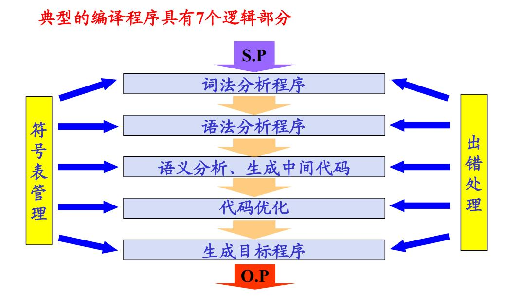

# 编译原理与技术总结

## 第一章 绪论

### 主要内容

本章通过对编译原理课程的介绍，引出了编译程序的概念，着重讨论了**编译程序与解释程序的区别**，揭示了**编译程序在计算机运行时的地位和作用**；通过本章的学习，对编译程序的词法分析、语法分析、语义分析和中间代码生成、代码优化、目标代码生成、错误检查和处理、符号表管理等**七个**部分的功能和作用有一定的了解；了解编译程序**前端**、**后端**，执行“遍”概念。

### 学习要求

编译程序的概念、编译程序与解释程序的区别，明确编译程序的七个组成部分，了解七个组成部分的功能和作用。了解遍、前端和后端等概念。

### 重点、难点

重点掌握编译程序的概念和编程程序的七个组成部分。

（8个逻辑部分：将生成中间代码也拆出来了）

### 编译程序

- 编译程序与解释程序的区别：是否生成中间代码
- 编译程序：若源程序是用高级语言书写，经加工后得到目标程序，上述翻译过程称“编译”

### 前端/后端

- 前端：通常将与源程序有关的编译部分称为前端。
  - 词法分析、语法分析、语义分析、中间代码生成、代码优化（分析部分）
  - 特点：与源语言有关
- 后端：与目标机有关的部分称为后端。
  - 目标程序生成（与目标机有关的优化）（综合部分）
  - 特点：与目标机有关

### 遍

- 遍：对源程序（包括源程序中间形式）从头到尾扫描一次，并做有关的加工处理，生成新的源程序中间形式或目标程序，通常称之为一遍。

## 第二章 文法和语言

### 主要内容

本章介绍了字母表、符号串和符号串集等概念，并介绍了求符号串的子串、长度、连接、方幂和字符串集的和、积、闭包的运算；通过文法推导的例子，引出了**文法**、**语言**、**BNF范式**、**推导**、**归约**的概念，说明了**文法和语言的关系**，介绍了**规范推导**、**规范归约**；

通过递归的概念，介绍了**递归文法**的定义；

通过树的概念，引出了**语法树**、**子树**、**短语**、**简单短语**、**句柄**、**二义性**的概念，并介绍了通过语法树求短语、句柄、简单短语，**文法二义性**的算法，通过推导和归约的方法求出语法树的方法；

本章最后介绍了**文法的乔姆斯基分类**。

### 学习要求

了解**字母表**、**符号串**、**符号串集**、**递归**、**BNF范式**、**推导**、**归约**、**句子**、**句型**等概念，了解符号串的前缀、后缀、**子串**、**长度**、**连接**、**方幂**和字符串集的**和**、**积**、**闭包**的求法；掌握**文法**、**语言**的定义；理解**文法和语言的关系**；理解什么是**规范推导**、**规范归约**；掌握**规范推导、规范归约的算法**，并能够求出对应的语法树；熟练掌握**根据语法树求短语、简单短语、句柄**的算法；

通过给定文法，掌握**求文法二义性**的方法；

了解**文法的分类**，并重点掌握2型文法和3型文法的定义。

### 二义性文法的算法

- 假设文法的一个句子，如果对此句子的推导存在两棵不同的语法树，则为二义性文法。
- 假设文法的一个句子，如果对此句子存在两个不同的规范推导过程（最左推导亦然），则为二义性文法。
- 假设文法的一个句子，如果对此句子的某个规范句型存在两个不同的句柄，则为二义性文法。
